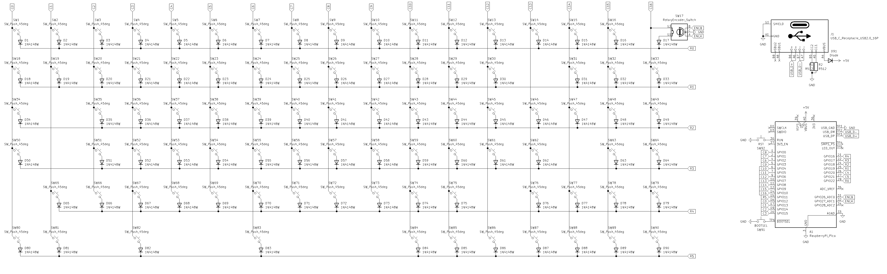
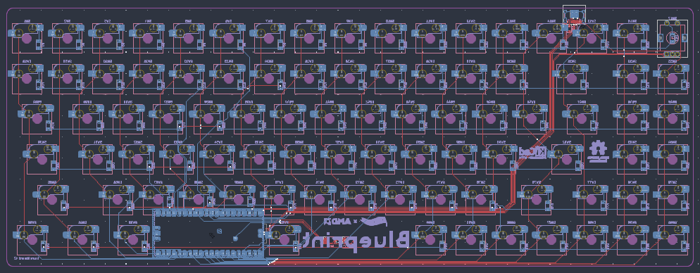
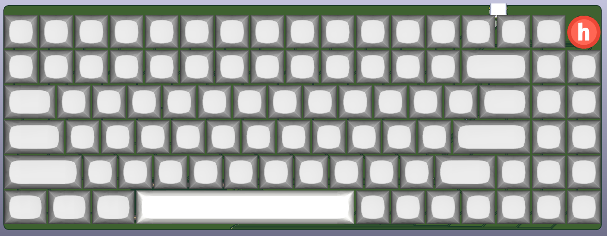
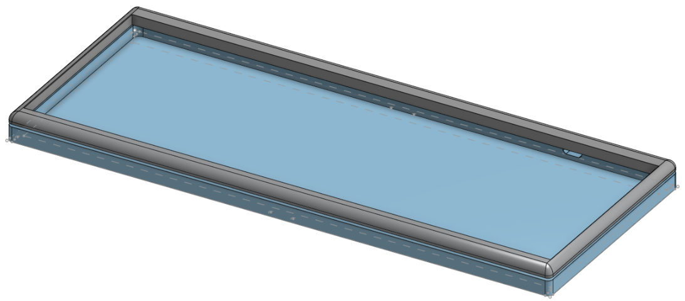
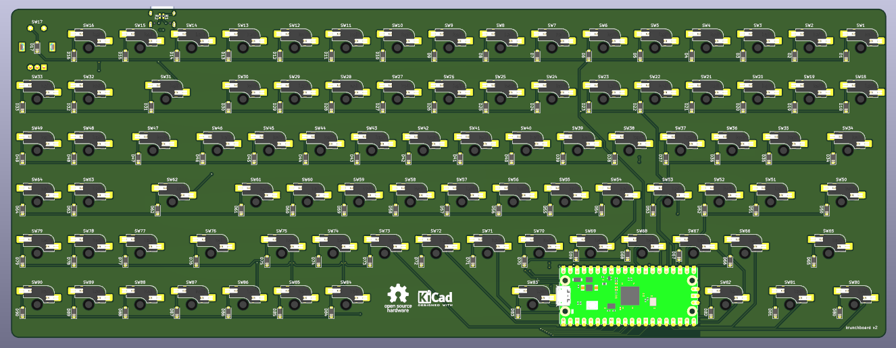
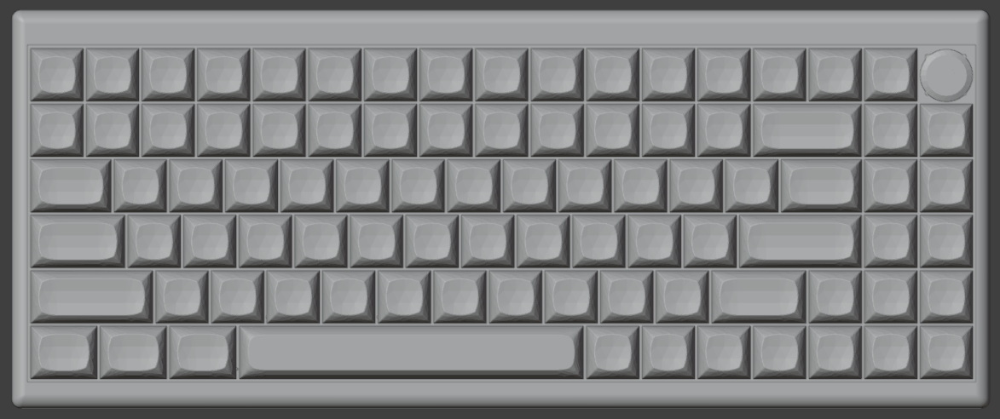
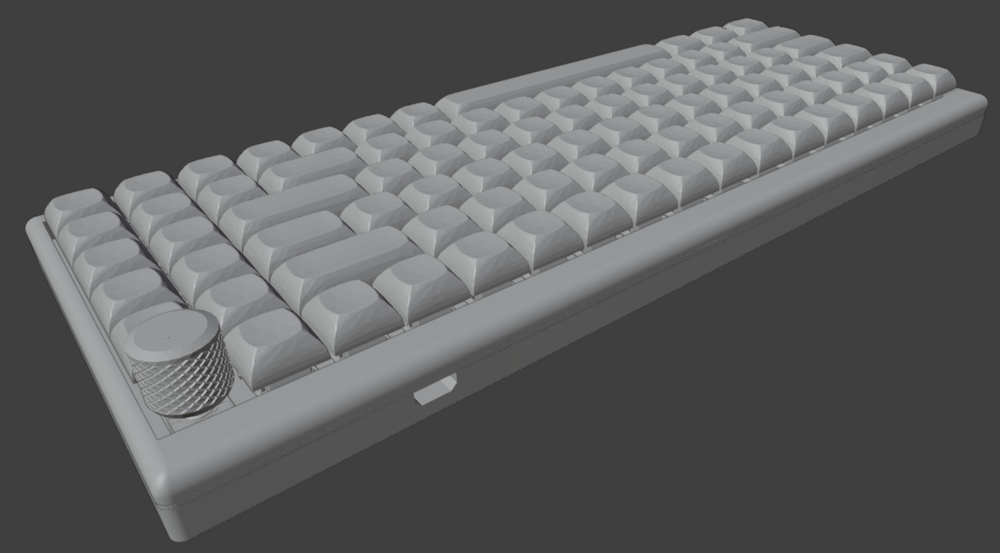

# krunchboard-90
A custom 75% (84+5+1) ANSI mechanical keyboard powered by a Raspberry Pi Pico with KMK

# About
This keyboard has 84 regular keys, 5 programmable macro keys, and 1 switch within the rotary encoder.

## Special Keys

Function:

- Fn+F1: Previous media

- Fn+F2: Pause media

- Fn+F3: Next media

Rotary encoder:

- Turn: Volume Up/Down

- Press and turn: Brightness Up/Down

- Double press: Mute

[KLE](https://www.keyboard-layout-editor.com/##@@_a:6%3B&=Esc&_a:4%3B&=F1%0AMute&=F2%0AVOLD&=F3%0AVOLU&=F4%0APrev&=F5%0APause&=F6%0ANext&_a:6%3B&=F7&=F8&=F9&=F10&_a:4%3B&=F11%0ABRID&=F12%0ABRIU&_a:5%3B&=PrtSc%0ANmLk&=Pause%0AScrLk&=Delete%0AInsert&_a:4%3B&=Rotary%0AMute%3B&@=~%0A%60&=!%0A1&=%2F@%0A2&=%23%0A3&=$%0A4&=%25%0A5&=%5E%0A6&=%2F&%0A7&=*%0A8&=(%0A9&=)%0A0&=%2F_%0A-&=+%0A%2F=&_a:6&w:2%3B&=Backspace&=Home&_a:7%3B&=%3B&@_a:4&w:1.5%3B&=Tab&=Q&=W&=E&=R&=T&=Y&=U&=I&=O&=P&=%7B%0A%5B&=%7D%0A%5D&_w:1.5%3B&=%7C%0A%5C&_a:6%3B&=Page%20Up&_a:7%3B&=%3B&@_a:4&w:1.75%3B&=Caps%20Lock&=A&=S&=D&=F&=G&=H&=J&=K&=L&=%2F:%0A%2F%3B&=%22%0A'&_a:6&w:2.25%3B&=Enter&=Page%20Down&_a:7%3B&=%3B&@_a:6&w:2.25%3B&=Shift&_a:4%3B&=Z&=X&=C&=V&=B&=N&=M&=%3C%0A,&=%3E%0A.&=%3F%0A%2F%2F&_a:6&w:1.75%3B&=Shift&_a:7%3B&=%E2%86%91&_a:6%3B&=End&_a:7%3B&=%3B&@_a:6&w:1.25%3B&=Ctrl&_w:1.25%3B&=Win&_w:1.25%3B&=Alt&_a:7&w:6.25%3B&=&_a:6%3B&=Alt&=Fn&=Ctrl&_a:7%3B&=%E2%86%90&=%E2%86%93&=%E2%86%92&=)

# Images

| PCB                      | 3D View                         |
|--------------------------|---------------------------------|
|    |  |
|  |    | 

# BOM

| Qty | Item                                         | Notes                                     | Cost (USD)       | URL |
|-----|----------------------------------------------|-------------------------------------------|------------------|-----|
| 89  | MX-Style key switches                        | Already have                              | 9.90             | [AE](https://www.aliexpress.com/item/1005002378701948.html) |
| 89  | Kailh MX hotswap socket                      | Already have                              | 8.11             | [AE](https://www.aliexpress.com/item/1005007052649640.html) |
| 90  | 1N4148W SOD-123 Diode                        | Already have                              | 2.32             | [AE](https://www.aliexpress.com/item/1005009063199018.html) |
| 1   | EC11E Rotary encoder (With switch)           | Already have                              | 2.42             | [AE](https://www.aliexpress.com/item/1005008413622715.html) |
| 3   | MX Stabilizer (3x2u, 1x6.25u)                | Already have                              | 2.42             | [AE](https://www.aliexpress.com/item/1005007212869086.html) |
| 1   | ANSI Keycaps set                             | Already have                              | 7.00             | [AE](https://www.aliexpress.com/item/1005007321700850.html) |
| 1   | Raspbery Pi Pico (RP2040 or RP2350)          | Already have                              | 2.30             | [AE](https://www.aliexpress.com/item/1005006054409042.html) |
| 1   | USB-C Socket (SMD)                           | Already have                              | 1.00             | N/A |
| 2   | 5.1k/4.7k 0805 SMD resistor                  | Already have                              | 1.00             | N/A |
| 4   | M2 Screw (13.9mm max, I used 12mm)           | Already have                              | 1.42             | [AE](https://www.aliexpress.com/item/1005003670389142.html) |
| 4   | M2 Heatset Insert (OD3.2mm, 3mm deep)        | Already have                              | 1.73             | [AE](https://www.aliexpress.com/item/1005007640664497.html) |
| 6   | Stick-on rubber feet (Optional)              | Already have                              | 1.18             | [AE](https://www.aliexpress.com/item/1005006832476105.html) |
| 1   | PCB                                          | (Shipping/Tax included + $20 coupon)      | 15.58            | [JLCPCB](https://jlcpcb.com) |
| 1   | 3D Printed case and plate (Blueprint only)   | print-legion                              | 4.65             | N/A |
|     |                                              | Total:                                    | 56.38 [20.23]    |     |

